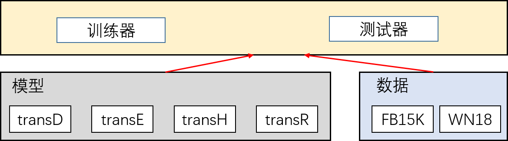

# 目录

## 模型名称

知识图谱补全是从已知的知识图谱中提取出三元组(head,relation,tail)，为实体和关系进行建模，通过训练出的模型进行链接预测，以达成知识图谱补全的目标。

此处使用MindSpore实现常见的四种知识图谱模型（transD、transE、transH和transR），数据集包含FB15K和WN18两个数据集。


## 模型架构

尽管实现的四个模型有部分相似之处，但为了便于后续使用和测试，所实现的四个模型采用**相互独立**的方式定义，在训练时可根据需要选取模型和数据集进行训练，其结构如下：


## 数据集

所用的数据集为FB15K和WN18，使用论文中的数据。
论文：
[Translating Embeddings for Modeling Multi-relational Data Knowledge Graph Embedding by Translating on Hyperplanes Learning Entity and Relation Embeddings for Knowledge Graph Completion Knowledge Graph Embedding via Dynamic Mapping Matrix](https://dl.acm.org/doi/10.5555/2893873.2894046)

Paperwithcode：
https://github.com/thunlp/TensorFlow-TransX

### 数据集详情：

|  数据集   | 关系数 | 实体数 | 训练集样本数 | 验证集样本数 | 测试集样本数 |
|  ----  | ----  | ----  |  ----  | ----  | ----  |
| WN18  | 18 | 40,9443 | 141,442 | 5,000 | 5,000|
| FB15K  | 1,345 | 14,951 | 483,142 | 50,000 | 59,071|
||||||


注：论文中讲数据进行1-1、1-n等拆分出多个数据，实际仅用 `train2id.txt`, `valid2id.txt`,`test2id.txt`三个数据集。所给数据如下，[点击查看数据来源](https://github.com/thunlp/TensorFlow-TransX/blob/master/data/FB15K/test2id.txt)，第一行为文件行数，在使用时**应删掉第一行**。
```
59071
453 1347 37
3136 4357 588
8663 4522 307
2404 8386 186
722 806 37
1248 10937 26
9182 1043 20
```

> [数据下载地址](https://git.openi.org.cn/forcekeng/transX_data_log_model/src/branch/master/data)
> 下载后解压,data/下包含整理后的FB15K和WN18数据。

## 环境要求
开发语言：Python3
使用框架：Mindspore
requirements.txt
```
mindspore>=1.6.0
numpy
easydict
tqdm
```

## 快速入门
将代码和数据下载解压后，代码所在根目录记为`<root_dir>`。
### 基本配置 

在训练或测试时，应指定配置信息，修改`<root_dir>/src/config.py`中的`basic_config` 3项配置：

(1) 配置数据集文件夹`data_dir`，文件夹下应包含 `train2id.txt`,`valid2id.txt`,`test2id.txt`等三个文件，分别对应训练集、验证集和测试集。
(2) 数据集 `dataset`，可选 `FB15K`或`WN18`。

(3) 模型`model`，可选 `transD`, `transE`, `transH`或`transR`。


训练与测试：打开代码所在根目录
* 训练命令：`python train.py`
* 测试命令：`python eval.py`


说明1：训练和推理暂时仅支持CPU/GPU平台。


## 脚本说明

提供实现的细节

### 脚本和样例代码


目录结构如图所示：


各文件如下：
- eval.py: 验证脚本
- README.md: 本文档
- requirements.txt: Python库配置
- images/: README.md图谱
- src/config.py: 训练集和测试集配置
- src/dataset.py: 数据集读取类
- src/transD,E,H,R: 定义的知识图谱模型
- val/testTransD,E,H,R: 定义的测试各个模型的对应类

### 脚本参数
由于训练集不同，其实体数、关系数、训练参数等均不同，因此将配置根据数据集划分为 `fb15k_config` 和 `wn18_config`，两者参数含义一致，此处以 `fb15k_config` 进行说明。每个数据集中再配置每个模型的参数。
```python

fb15k_config = ed({
    # 全局参数
    "model": "transE",              # 模型，可选 {"transD", "transE", "transH", "transR"}
    "n_entity": 14951,              # 实体数量
    "n_relation": 1345,             # 关系数量
    
    # 训练参数
    "pre_model_path": "",        # 预训练模型保存路径
    "pretrained": False,         # 是否使用预训练模型，为True时需要pre_model_path指定正确路径
    "model_save_dir": "checkpoints/",   # 模型保存路径
    "log_save_file": "log.out",  # 训练日志保存路径
    "iterations": 1000000,      # 最大迭代次数
    "batch_size": 4096,         # 批处理大小
    "learning_rate": 0.001,                # 学习率
    
    # 模型参数
    ## transD参数
    "transD": {
        "n_entity_dim": 100,         # 实体编码维度
        "n_relation_dim": 100,       # 关系编码维度
        "margin": 1.0,              # 算法中计算损失时参数
        "norm": 1                   # 计算损失所用范数，可选{1,2}
    },
    ## transE参数
    "transE": {     
        "n_dim": 100,        # 编码维度，实体编码维度==关系编码维度
        "margin": 1.0,      # 算法中计算损失时参数
        "norm": 1           # 计算损失所用范数
    },
    ## transH参数
    "transH": {
        "n_dim": 100,       # 编码维度，实体编码维度==关系编码维度
        "margin": 1.0,      # 算法中计算损失时参数
        "norm": 1           # 计算损失所用范数
    },
    ## transR参数
    "transR": {
        "n_entity_dim": 100,        # 实体编码维度
        "n_relation_dim": 100,      # 关系编码维度
        "margin": 1.0,              # 算法中计算损失时参数
        "norm": 1                   # 计算损失所用范数
    }
})

```

## 训练过程

目前训练过程和评估只支持CPU/GPU，使用Ascend训练损失会不断上升，无法完成训练。

训练时，每次随机抽取 `batch_size` 个三元组，并进行*corrupt*，每次训练为一次`iteration`，最多训练`iterations`次，`iterations`训练参数可从 `src/config.py` 进行配置。

### 训练
#### 训练方法：
打开 train.py 所在目录，运行：
```python
python train.py
```

可配置`src/config.py`的`log_save_file`项配置log输出路径。Linux系统下，如果想保存输出内容至`train.out`文件，也可运行
```bash
python train.py | tee train.out
```
补充：`tee`为Linux的命令，可将控制台输出同时输出至指定路径的文件`<log_out_path>`。


#### 训练过程日志
以GPU在数据集WN18上训练transE为例，其部分日志如下：
```log
# python train.py 
dataset = WN18, model = transR
read file path: /dataset/data/WN18/train2id.txt
data_loader initialized!
<=================== 开始训练 ===================>
epoch [1000], loss = 1331.6389914550782, 1000 iterations spend 0.12995397647221882 minutes!
epoch [2000], loss = 975.5102862548828, 1000 iterations spend 0.11221280495325724 minutes!
...
epoch [808000], loss = 1.239701193332672, 1000 iterations spend 0.10795061588287354 minutes!
epoch [809000], loss = 1.3451107335090637, 1000
...
loss_record:
 [1331.6389914550782, ..., 1.239701193332672]
>=================== 训练结束 ===================<
```

- 说明1：训练checkpoint将被保存在`log.out`中，可在训练前修改`src/config.py` 中的配置修改保存路径。
- 说明2：其他数据集或模型的[训练日志可从此处下载](https://git.openi.org.cn/forcekeng/transX_data_log_model/src/branch/master/log)。部分训练日志格式略有区别，但包含迭代次数、损失和耗时等信息。


## 评估

### 评估过程

评估过程分为两步，首先指定评估数据集、评估模型等参数。具体参数如下：
```python
  # 数据集目录
  data_dir = "/dataset/data/WN18/"    
  # 数据集:可选{"FB15K", "WN18"}     
  dataset = "WN18" 
  # 模型:可选{"transD", "transE", "transH", "transR"}
  model="transH"     
  # 训练好的参数，即实体等相关编码，为.ckpt文件
  param_path = "/model/fb15k_transE.ckpt" # 填入训练好的权重所在路径
```

### 评估命令
```python
python eval.py
```
> [点击下载训练好的ckpt模型参数](https://git.openi.org.cn/forcekeng/transX_data_log_model/src/branch/master/model)，
> 模型文件名包含数据集、模型名、无filter的hits@10和mean-rank值等信息。


### 评估结果
对所给数据集，推理结果如下：

- 针对hits@10指标

|模型|FB15K hits@10(%)(no filter)| WN18 hits@10(%)(no filter)| FB15K hits@10(%)(with filter)| WB18 hits@10(%)(with filter)|
|---|---|---|---|---|
|  transD | 50.24  | 80.28  | 67.87  |  92.58 |
|  transE | 48.02  | 50.73  | 66.91  |  66.91 |
|  transH | 46.26  | 71.78  | 62.88  |  83.22 |
|  transR | 39.03  | 65.01  |  53.26 | 74.56  |

- 针对Mean-Rank指标
  
对于Mean-Rank指标，与filter无关
|模型|FB15K mean-rank| WN18 mean-rank|
|---|---|---|
|  transD |218.3| 659.5 |
|  transE |244.9| 1003.2 |
|  transH |267.8| 697.5 |
|  transR |271.7| 685.5 |

运行结束后，会输出类似下面的内容：
```log
# python eval.py
read file path: /dataset/data/FB15K/test2id.txt
100%|████████████████████████████████████████████████████████████████████| 1000/1000 [00:57<00:00, 17.29it/s]
**************************************************
model: transR, dataset: FB15K, test, is_filter: False
hits10 = 0.33, mean_rank = [491.052]
**************************************************
```

## 性能

### 训练性能

提供您训练性能的详细描述，例如finishing loss, throughput, checkpoint size等

你可以参考如下模板
对模型transD、transE、transH、transR使用CPU/GPU平台训练，参数如下。多个模型采用单核2U8G CPU或PCIE V100-32G GPU等训练。

|参数 | 值 | |
| --- | ---| ---| 
|Resource| GPU: 1*T4, CPU: 4, Memory: 32GB, Shared Memory: 16GB | 
|MindSpore Version| 1.17.0 |
|Dataset| FB15K或WN18|
|Training Parameters| batch_size=4096(for FB15K),  batch_size=1024(for WN18), iterations=1-000-000, learning_rate=0.001 |
|Loss| L1 norm |
| Uploaded Date       | 09/14/2022 (month/day/year) |
|Total time| ≈2.8h |
| Scripts                    | [link](https://gitee.com/mindspore/models/tree/master/official/cv/)                       |

每次迭代（1个batch_size对应的样本）耗时：
|  模型     |   耗时-FB15K (ms)  | 耗时-WN18 (ms) | 收敛后平均损失-FB15K| 收敛后平均损失-WN18 | 
| ---       | --- | --- | --- |--- |
|transD     | 9.5 | 9.8    |  12.27    |0.55 |
|transE     | 8.0|   7.6   | 16.1          | 1.0 |
|transH     | 9.2|   9.0   | 12.0          | 0.6|
|transR     | 13.9|  8.3   |  15.4         |  0.7  |


说明：模型的实体和关系编码维度和后文的“推理性能”中一致。

### 推理性能

提供推理性能的详细描述，包括耗时，精度等

你可以参照如下模板

| Parameters          | GPU                      |
| ------------------- | --------------------------- |
| Model Version       | transD, transE, transH, transR |
| Resource            | GPU: 1*T4, CPU: 4, Memory: 16GB, Shared Memory: 8GB |
| Uploaded Date       | 09/14/2022 (month/day/year) |
| MindSpore Version   | 1.16.0                       |
| Dataset             | FB15K/WN18                   |


推理编码维度与模型大小

| 模型 |  实体/关系编码维度（FB15K） | 实体/关系编码维度（WN18） | 模型大小（FB15K）  | 模型大小（WN18） | 推理耗时-FB15K（ms/样本） |推理耗时-WN18（ms/样本） |
|---|---|---| ---| ---| --- | --- |
|transD|  100 / 100  | 50 / 50 | 13M| 16M   | 79.4 | 119 |
|transE|  100 / 100 | 50 / 50 |6.3M| 7.9M | 52.8 | 79.5 |
|transH|  100 / 100 | 50 / 50 |6.8M| 7.9M | 59.2| 82.0 |
|transR|  100 / 100 | 30 / 30 |58M| 4.8M  | 61.2| 65.7 |

- 说明1：表中硬件环境为：GPU: 1*T4, CPU: 4, Memory: 16GB, Shared Memory: 8GB。
- 说明2：表中推理耗时为无filter时测得结果，有filter时推理耗时变为原来的2至4倍。
- 说明3：总推理耗时与样本数量相关，表中显示单个样本平均耗时。FB15K测试集样本数为59071，WN18数据集样本数为5000，可据此估计完成所有样本耗时分别为79分钟左右和6分钟左右。


## 贡献指南

如果你想参与贡献昇思的工作当中，请阅读[昇思贡献指南](https://gitee.com/mindspore/models/blob/master/CONTRIBUTING_CN.md)和[how_to_contribute](https://gitee.com/mindspore/models/tree/master/how_to_contribute)

### 贡献者

此部分根据自己的情况进行更改，填写自己的院校和邮箱

* email: forcekeng@126.com (同济大学)
* [gitee](https://gitee.com/forcekeng) 

## ModelZoo 主页

请浏览官方[主页](https://gitee.com/mindspore/models)。
